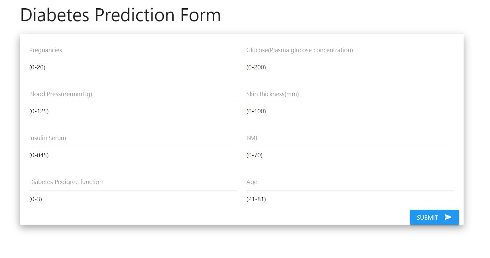
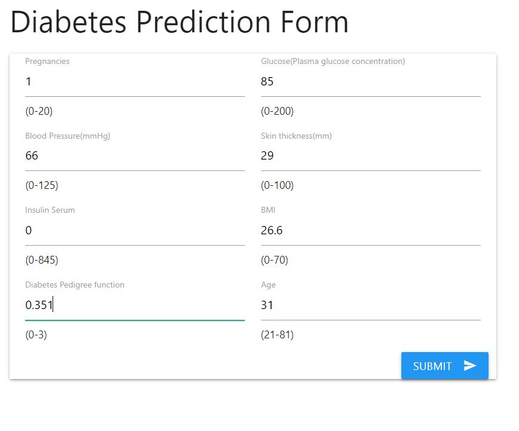

# Diabetes Prediction - Project Overview
- This project uses a machine learning model to predict whether a person is diabetic or not.
- It uses the famous Pima Indian Diabetic dataset which involves certain diagnostic measurements for prediction.
- This machine learning model uses the Logistic Regression algorithm to derive at a solution.
- Built an API using Flask.
- It also involves a simple website for the user to predict the outcome easily.

## Code and Resources used
- **Languages used:** Python version 3.7, HTML  
- **Packages:** pandas, numpy, sklearn, flask, json, pickle 
- **Flask Productionization:** https://towardsdatascience.com/productionize-a-machine-learning-model-with-flask-and-heroku-8201260503d2 , https://www.geeksforgeeks.org/deploy-machine-learning-model-using-flask/
- **For Web Framework Requirements:**  ```pip install -r requirements.txt```
- **More about dataset:** https://www.kaggle.com/uciml/pima-indians-diabetes-database
- **Youtube link referred:** https://www.youtube.com/watch?v=MpF9HENQjDo

## About Dataset
This dataset is originally from the National Institute of Diabetes and Digestive and Kidney Diseases. The objective of the dataset is to diagnostically predict whether or not a patient has diabetes, based on certain diagnostic measurements included in the dataset. Several constraints were placed on the selection of these instances from a larger database. In particular, all patients here are females at least 21 years old of Pima Indian heritage. Following are the features:
- Pregnancies: Number of times pregnant
- Glucose: Plasma glucose concentration a 2 hours in an oral glucose tolerance test
- BloodPressure: Diastolic blood pressure (mm Hg)
- SkinThickness: Triceps skin fold thickness (mm)
- Insulin: 2-Hour serum insulin (mu U/ml)
- BMI: Body mass index (weight in kg/(height in m)^2)
- DiabetesPedigreeFunction: Diabetes pedigree function
- Age: Age (years)
- Outcome: Class variable (0 or 1)

## Model Building and Prediction
1. Import the necessary libraries and load the dataset.
2. Perform data preprocessing, replace 0's with NaN's and NaN with mean values.
3. Select the features and the output variable(X,y).
4. Split the dataset into train and test set with a ratio of 80:20 respectively.
5. Used the logistic regression model for prediction that gave an accuracy of around 76%.
6. Finally save the model as a pickle file to use in the flask app.

## Productionization 
In this step, I built a flask API endpoint that was hosted on a local webserver by following along with the TDS tutorial in the reference section above. The API endpoint takes in a request with a list of 8 values needed for prediction and returns a statement indicating the presence of diabetes or not.

## Building of Website
Built a simple website having two files, index.html and results.html. The index file takes in all values from the user that are needed to predict in a form and the result is obtained on clicking the submit button in the result.html page.

## Screenshots




## Setup Instructions
1. This application needs Python version 3.7 to be installed in the system.
2. Install all the required packages using ```pip install -r requirements.txt```
3. To run the application run ```python app.py```
